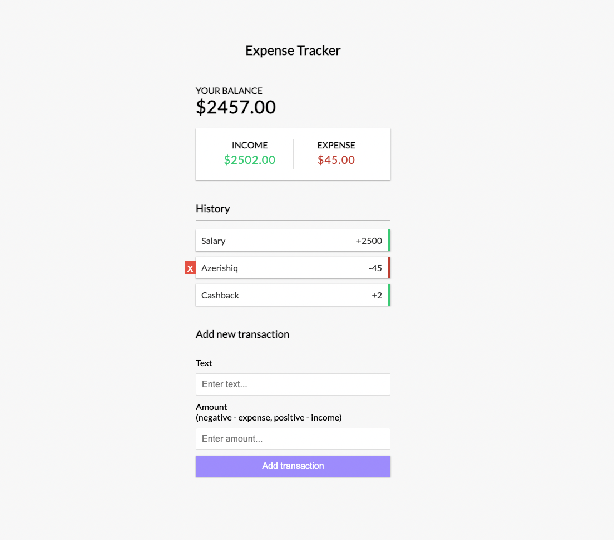

# Expense Tracker 💰

### Task 🎯🎯

Create an amazing Expense tracker app using React.js 🚀

#### Mandatory tasks:
1. You app must have at least 3 component: 
  - ***Balance*** - which will display *total balance*, *incomes* and *expenses*.
  - ***History*** - which will display List of your *incomes* and *expenses*.
  - ***Transaction*** - form where you can add a new transaction.
2. If the transaction amount is less than zero, then the expense increase. If the transaction amount is greater than zero, then the income increases. Note: **Do not** forget to update **Total balance** as well!
3. When you hover over any transaction, a **delete** button should appear. By clicking this button, you can delete any transaction.

#### Optional tasks:
1. Add **update** button to each transaction. By clicking this button, you can update any transaction.
2. Save all data in local memory 📝,.
3. If the user visits the page for the first time, then display a **modal window** where the user will enter the initial balance. After that, the user will start using the application with the specified balance.

---

